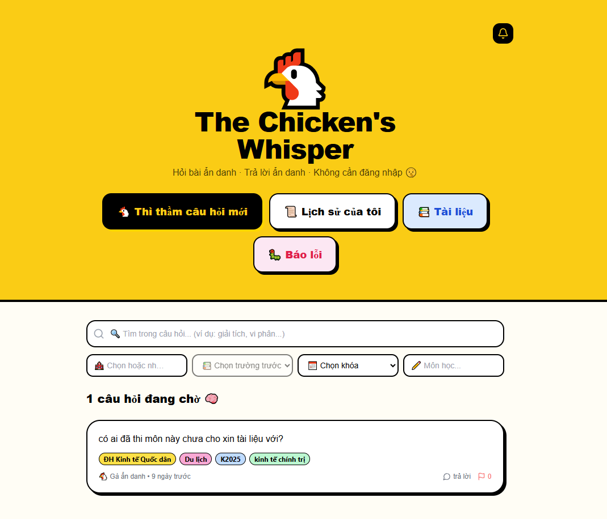
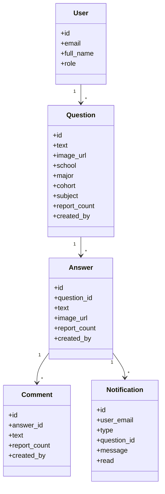
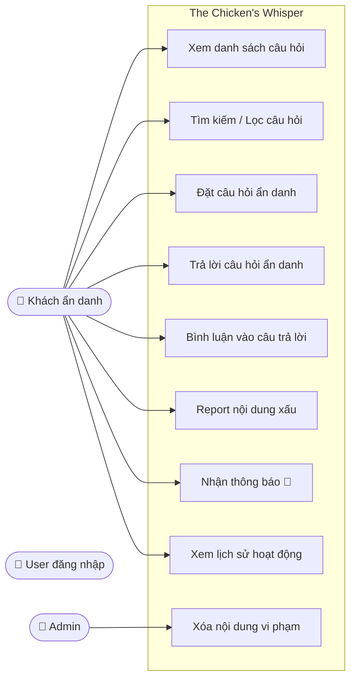
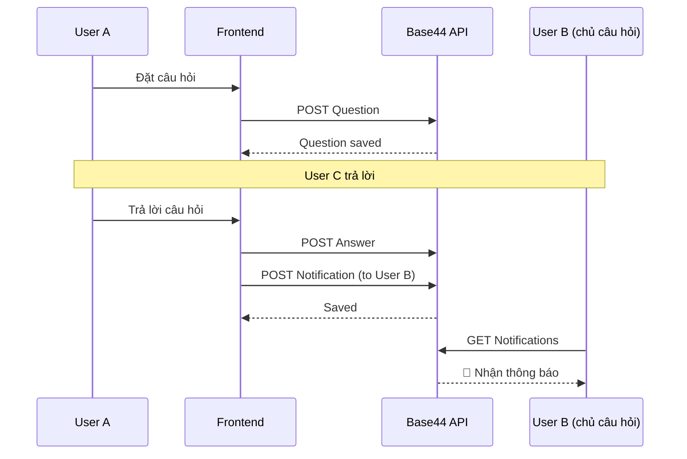
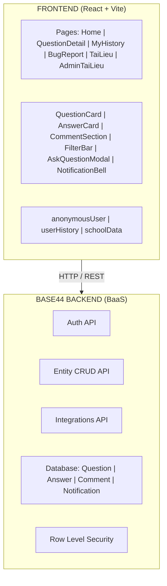

# 🐔 The Chicken's Whisper


> Ứng dụng hỏi đáp ẩn danh cho học sinh, sinh viên: đặt câu hỏi, trả lời và bình luận mà không cần hiển thị danh tính.



## Mục lục

- [Giới thiệu](#giới-thiệu)
- [Ý nghĩa & ứng dụng](#ý-nghĩa--ứng-dụng)
- [Chức năng chính](#chức-năng-chính)
- [Yêu cầu và phân tích](#yêu-cầu-và-phân-tích)
- [Kiến trúc và thiết kế](#kiến-trúc-và-thiết-kế)
- [Cấu trúc dự án](#cấu-trúc-dự-án)
- [Cài đặt và chạy](#cài-đặt-và-chạy)
- [Cấu hình môi trường](#cấu-hình-môi-trường)
- [Bảo mật và kiểm thử](#bảo-mật-và-kiểm-thử)
- [License](#license)

---

## Giới thiệu

`The Chicken's Whisper` là nền tảng hỏi đáp ẩn danh dành cho học sinh, sinh viên, cho phép:

- đặt câu hỏi theo trường/ngành/khóa học,
- trả lời câu hỏi và bình luận,
- nhận thông báo khi có hoạt động liên quan,
- xem lại lịch sử hoạt động.

Ứng dụng xây dựng bằng React + Vite với backend Base44 BaaS và tập trung vào trải nghiệm mượt mà, phản hồi nhanh và tính riêng tư.

## Ý nghĩa & ứng dụng

Ứng dụng hướng tới:

- hỗ trợ chia sẻ tài liệu học tập, giải đáp bài tập,
- tạo môi trường thảo luận ẩn danh để học sinh cởi mở hơn,
- giảm rào cản giao tiếp trong lớp học và nhóm học.

## Chức năng chính

1. Đặt câu hỏi ẩn danh
2. Trả lời câu hỏi ẩn danh
3. Bình luận vào câu trả lời
4. Tìm kiếm và lọc câu hỏi theo trường/ngành/khóa
5. Nhận thông báo khi có trả lời mới
6. Xem lịch sử hoạt động cá nhân
7. Quản lý nội dung xấu / report

## Yêu cầu và phân tích

### Yêu cầu chức năng

- Người dùng có thể xem danh sách câu hỏi.
- Người dùng có thể đặt câu hỏi mới.
- Người dùng có thể trả lời và bình luận.
- Người dùng có thể lọc, tìm kiếm và duyệt câu hỏi.
- Người dùng được nhắc báo khi có hoạt động mới.
- Người dùng có thể xem lịch sử câu hỏi/trả lời của bản thân.

### Yêu cầu phi chức năng

- Giao diện thân thiện, phản hồi nhanh.
- Tương thích trình duyệt web hiện đại.
- Bảo mật thông tin người dùng và dữ liệu ẩn danh.
- Khả năng chịu tải hệ thống vừa phải.

### Đối tượng sử dụng

- Học sinh, sinh viên cần hỏi bài.
- Giáo viên và trợ giảng tạo môi trường trò chuyện an toàn.
- Nhóm học tập muốn chia sẻ tài liệu và kiến thức.

## Kiến trúc và thiết kế

### Tech stack

| Layer     | Công nghệ                            |
|-----------|--------------------------------------|
| Frontend  | React 18, Vite, Tailwind CSS         |
| UI        | shadcn/ui, Lucide React              |
| Backend   | Base44 BaaS                          |
| Auth      | Base44 Auth                          |
| Storage   | Base44 Entity DB + localStorage      |
| File      | Base44 File Upload                   |

### Tổng quan hệ thống

- Frontend React điều hướng với `react-router-dom`.
- Mô hình xác thực và quản lý người dùng dùng Base44 Auth.
- Cơ sở dữ liệu Entities tại Base44 lưu `Question`, `Answer`, `Comment`, `Notification`.
- Tính năng upload ảnh hỗ trợ minh họa câu hỏi/trả lời.

### Thành phần chính

- `src/pages/`: trang Home, chi tiết câu hỏi, lịch sử, báo lỗi, tài liệu, admin tài liệu.
- `src/components/`: các module giao diện như `QuestionCard`, `AnswerCard`, `CommentSection`, `FilterBar`, `AskQuestionModal`, `NotificationBell`.
- `src/lib/`: logic hỗ trợ danh tính ẩn danh, lưu lịch sử localStorage, dữ liệu trường/ngành.
- `src/api/base44Client.js`: khởi tạo kết nối Base44.

## UML & Kiến trúc hệ thống

### 1. Entity Diagram (Class Diagram)



### 2. Use Case Diagram



### 3. Sequence Diagram



### 4. System Architecture



---

## Cấu trúc dự án

```text
PROJECT/
├── src/
│   ├── api/
│   │   └── base44Client.js
│   ├── components/
│   │   ├── AnswerCard.jsx
│   │   ├── AskQuestionModal.jsx
│   │   ├── CommentSection.jsx
│   │   ├── FilterBar.jsx
│   │   ├── Footer.jsx
│   │   ├── ImageCapture.jsx
│   │   ├── NotificationBell.jsx
│   │   ├── ProtectedRoute.jsx
│   │   ├── QuestionCard.jsx
│   │   ├── UserNotRegisteredError.jsx
│   │   └── ui/
│   ├── lib/
│   │   ├── AuthContext.jsx
│   │   ├── anonymousUser.js
n    │   ├── app-params.js
│   │   ├── base44.js
│   │   ├── PageNotFound.jsx
│   │   ├── query-client.js
│   │   ├── schoolData.js
│   │   └── userHistory.js
│   ├── pages/
│   │   ├── AdminTaiLieu.jsx
│   │   ├── BugReport.jsx
│   │   ├── Home.jsx
│   │   ├── MyHistory.jsx
│   │   ├── QuestionDetail.jsx
│   │   ├── TaiLieu.jsx
│   │   └── index.css
│   └── App.jsx
├── public/
├── assets/
├── package.json
└── README.md
```

## Cài đặt và chạy

```bash
git clone https://github.com/ptuan28/WEB.git
cd PROJECT
npm install
npm run dev
```

Mở trình duyệt tại `http://localhost:5173`.

## Cấu hình môi trường

Tạo file `.env.local` với nội dung:

```env
VITE_BASE44_APP_ID=your_app_id
VITE_BASE44_APP_BASE_URL=https://api.base44.com
VITE_BASE44_API_KEY=your_api_key
RESEND_API_KEY=your_resend_key
```

> Nếu thiếu cấu hình, ứng dụng sẽ hiển thị thông báo yêu cầu cấu hình môi trường.

## Bảo mật và kiểm thử

- Kiểm soát truy cập theo `created_by` và `user.email`.
- Report nội dung xấu tăng `report_count` và có thể bật cơ chế xóa tự động.
- Dữ liệu cá nhân chỉ lưu trữ khi cần thiết; nhiều tương tác vẫn ẩn danh.
- Kiểm thử chính:
  - xác thực Base44,
  - tạo câu hỏi/trả lời,
  - lọc/tìm kiếm,
  - thông báo và lịch sử hoạt động.

## License

MIT License
