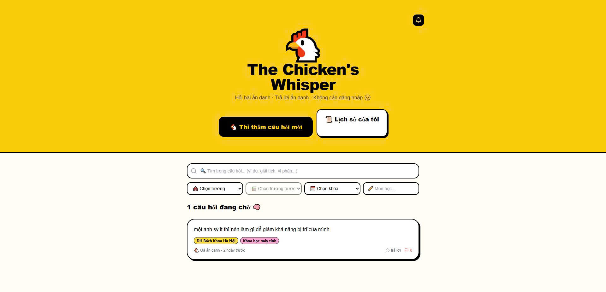
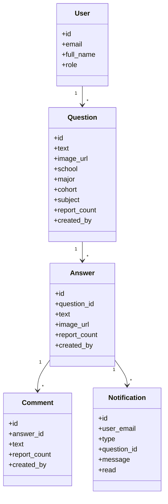
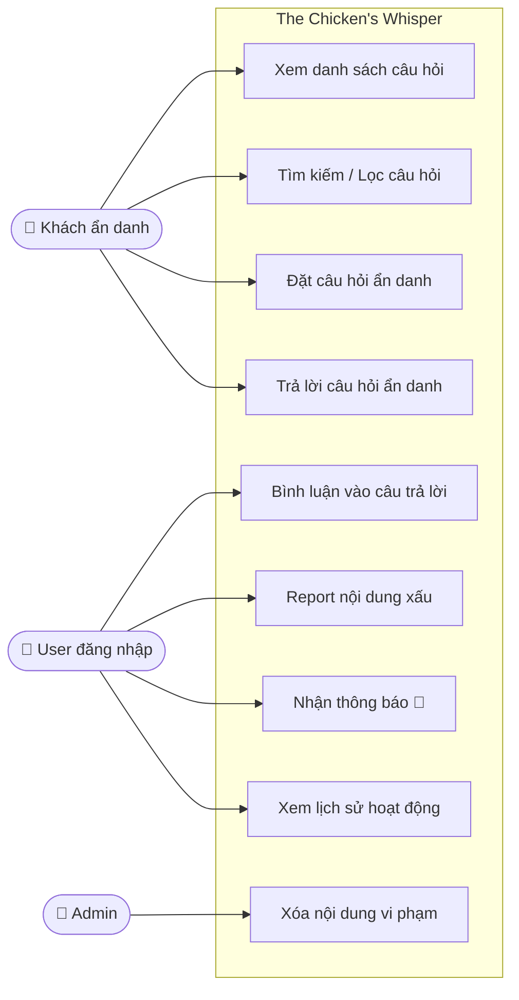
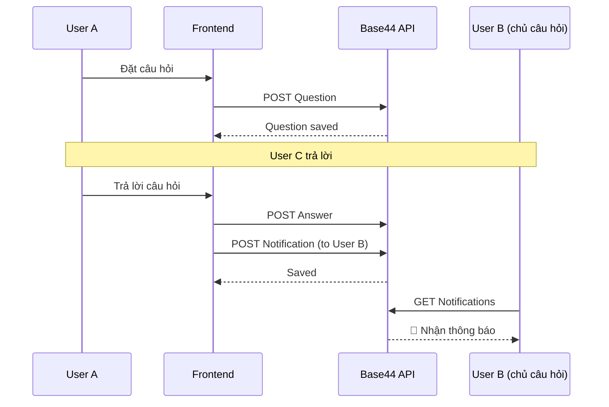
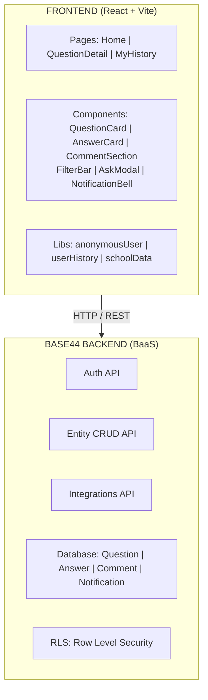
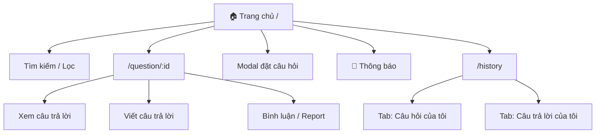

# 🐔 The Chicken's Whisper


> **Hỏi bài ẩn danh · Trả lời ẩn danh · Không cần đăng nhập 🤫**



## 🌐 Demo trực tuyến

👉 **Dùng thử ngay — không cần đăng ký!**

---

## 🛠️ Tech Stack

| Layer     | Công nghệ                            |
|-----------|--------------------------------------|
| Frontend  | React 18, Vite, Tailwind CSS         |
| UI        | shadcn/ui, Lucide React              |
| Backend   | Base44 BaaS                          |
| Auth      | Base44 Auth                          |
| Storage   | Base44 Entity DB + localStorage      |
| File      | Base44 File Upload                   |

---

## 🚀 Chạy dự án

**Bước 1 — Clone**
```bash
git clone https://github.com/ptuan28/WEB.git
cd WEB
```

**Bước 2 — Cài dependencies**
```bash
npm install
```

**Bước 3 — Cấu hình môi trường**

Tạo file `.env.local`:
```
VITE_BASE44_APP_ID=your_app_id
VITE_BASE44_APP_BASE_URL=https://api.base44.com
VITE_BASE44_API_KEY=your_api_key
```

**Bước 4 — Chạy**
```bash
npm run dev
# Mở trình duyệt tại http://localhost:5173
```

---

## 📁 Cấu trúc dự án

```
PROJECT/
├── src/
│   ├── pages/
│   │   ├── Home.jsx              # Trang chủ - danh sách câu hỏi
│   │   ├── QuestionDetail.jsx    # Chi tiết câu hỏi + trả lời
│   │   └── MyHistory.jsx         # Lịch sử hoạt động
│   ├── components/
│   │   ├── AskQuestionModal.jsx  # Modal đặt câu hỏi
│   │   ├── QuestionCard.jsx      # Card câu hỏi
│   │   ├── AnswerCard.jsx        # Card câu trả lời
│   │   ├── CommentSection.jsx    # Phần bình luận
│   │   ├── FilterBar.jsx         # Thanh lọc/tìm kiếm
│   │   ├── NotificationBell.jsx  # Chuông thông báo
│   │   └── ImageCapture.jsx      # Chụp/tải ảnh
│   ├── lib/
│   │   ├── anonymousUser.js      # Tạo danh tính ẩn danh
│   │   ├── userHistory.js        # Lưu lịch sử localStorage
│   │   └── schoolData.js         # Dữ liệu trường/ngành VN
│   └── api/
│       └── base44Client.js       # Khởi tạo Base44 SDK
├── .env.local                    # Biến môi trường (không commit)
└── README.md
```

---

## 🗂️ UML & Kiến trúc hệ thống

### 1. Entity Diagram (Class Diagram)



### 2. Use Case Diagram



### 3. Sequence Diagram (Luồng đặt câu hỏi & trả lời)



### 4. System Architecture



### 5. UI/UX Flow



---

## 🔐 Bảo mật

| Thao tác             | Điều kiện                              |
|----------------------|----------------------------------------|
| Tạo câu hỏi/trả lời  | Đã đăng nhập                           |
| Đọc Notification     | `user_email == user.email` hoặc admin  |
| Xóa Comment          | `created_by == user.email` hoặc admin  |
| Auto-xóa nội dung    | `report_count >= 5`                    |

---

## 🧠 Kỹ thuật OOP trong dự án

Dù dùng React (functional), dự án vẫn thể hiện rõ các nguyên lý OOP:

**1. Đóng gói (Encapsulation)**
Mỗi component quản lý state và logic riêng. Ví dụ: `AnswerCard` đóng gói logic report, xóa bên trong — bên ngoài chỉ cần truyền `answer` và `onDelete`.

**2. Trừu tượng hóa (Abstraction)**
`anonymousUser.js`, `userHistory.js`, `schoolData.js` trừu tượng hóa logic phức tạp thành các hàm đơn giản. Component cha không cần biết bên trong hoạt động thế nào.

**3. Tái sử dụng (Reusability)**
`NotificationBell` dùng ở cả `Home` và `QuestionDetail`. `ImageCapture` dùng ở cả modal hỏi và form trả lời. `getAnonIdentity` dùng ở nhiều component.

**4. Kết hợp (Composition)**
`QuestionDetail` → `AnswerCard` → `CommentSection`. Các component nhỏ lắp ghép thành UI phức tạp, thay vì kế thừa (inheritance).

---

## 📄 License

MIT © 2025 The Chicken's Whisper Team
